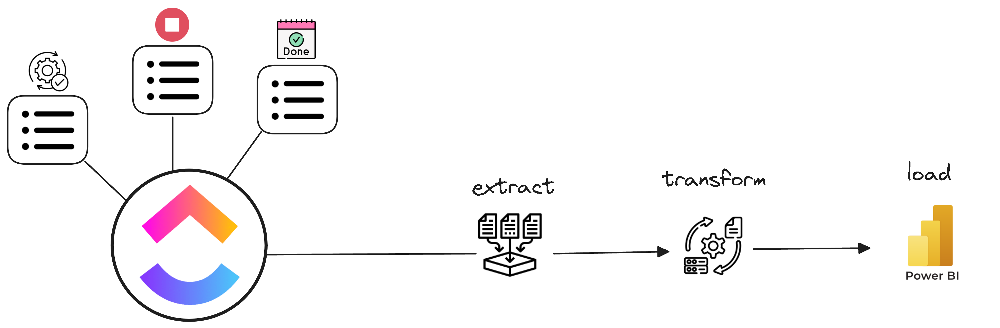

# Doc CLICKUPAPI

### This code has the focus to extract, transform & load data from customfields of lists in clickup ecosystem. The code consumes data from ClickUP API, clean the data and organize them for powerbi dashboards creations.